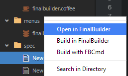
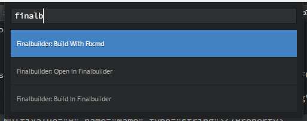

# FinalBuilder Package for Atom

Build FinalBuilder projects from Atom.

Select any FinalBuilder project available and call the building, inside FinalBuilder or command line. You can use projects that you are editing or anyone available in the Treeview.

You can use **Command Palette** or **Treeview Context Menu**.

## Available Commands

* Open in FinalBuilder
* Build in FinalBuilder
* Build with FBCmd

#### Tree-view Context Menu

#### Command Palette

## Compatibility

The package is compatible with FinalBuilder 7, and works with *compressed (fbz7)* and *uncompressed (fbp7)* projects

## TODO List

* Support for other FinalBuilder versions
* Display the build log inside Atom instead of external command prompt
* Display all available FinalBuilder projects available in your Atom project, using a `SelectListView`
